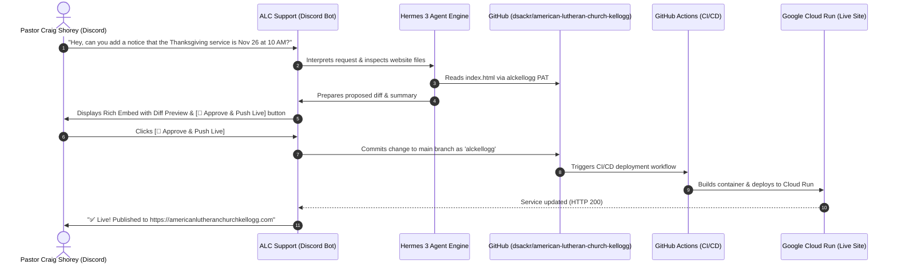

# ⛪ ALC Support — Discord Hermes AI Webmaster Bot

**ALC Support** is an autonomous AI Webmaster assistant for **Pastor Craig Shorey** and authorized church staff at **American Lutheran Church** (Kellogg, Idaho).

It connects **Discord** directly to the **GitHub repository** (`dsackr/american-lutheran-church-kellogg`) using a Personal Access Token (PAT) from the **`alckellogg`** GitHub account and triggers Google Cloud Run CI/CD deployments.

---

## 🌟 How ALC Support Works



---

## 🚀 Key Capabilities

1. **Natural Language Website Updates**:
   * Pastor Craig or staff can DM the bot or message in a private channel:
     * *"Change the sermon title on sermons.html to 'Grace in the Silver Valley'"*
     * *"Update the Sunday school registration note on visit.html"*
     * *"Add a notice on the homepage about Friday's fellowship potluck"*
2. **Photo & Banner Uploads**:
   * Upload an image in Discord with a prompt like *"Make this the new hero banner"* — the bot automatically optimizes the image, uploads it to `assets/images/` on GitHub as `alckellogg`, and updates the HTML.
3. **Safety Diff Previews & Interactive Buttons**:
   * Generates a full GitHub-style diff preview in Discord with **`[🚀 Approve & Push Live (via alckellogg)]`** and **`[❌ Cancel]`** buttons.
4. **Automated CI/CD Integration**:
   * Committing to GitHub immediately fires the automated GitHub Actions CI/CD pipeline, taking changes live to `https://americanlutheranchurchkellogg.com` in ~50 seconds.
5. **Role & Whitelist Security**:
   * Configurable `AUTHORIZED_USER_IDS` whitelist so only Pastor Craig and designated staff can authorize deployments.

---

## 🛠️ Step-by-Step Setup Guide

### Step 1: Create the Discord Bot & Invite to Server
1. Go to the [Discord Developer Portal](https://discord.com/developers/applications).
2. Click **New Application** and name it **ALC Support**.
3. In the **Bot** tab:
   - Click **Reset Token** and copy the **Bot Token**.
   - Under **Privileged Gateway Intents**, enable **Message Content Intent**.
4. In the **OAuth2 -> URL Generator** tab:
   - Scopes: `bot`, `applications.commands`
   - Bot Permissions: `Send Messages`, `Embed Links`, `Attach Files`, `Read Message History`, `Use Slash Commands`.
   - Open the generated URL in your browser to invite **ALC Support** to your Discord server.

---

### Step 2: Generate a GitHub PAT for `alckellogg`
1. Log into GitHub as **`alckellogg`**.
2. Go to **[GitHub Settings -> Developer Settings -> Personal Access Tokens (Classic)](https://github.com/settings/tokens)**.
3. Click **Generate new token (classic)**.
   - Note: `ALC Support Bot`
   - Expiration: No expiration (or preferred duration)
   - Scope: Select **`repo`** (Full control of private repositories and collaborator push access).
4. Copy the generated token (`ghp_...`).

---

### Step 3: Configure Environment
Copy `bot/.env.example` to `bot/.env`:
```bash
cp bot/.env.example bot/.env
```

Edit `bot/.env`:
```env
# Discord Token
DISCORD_BOT_TOKEN="your_discord_bot_token"

# GitHub PAT for alckellogg
GITHUB_PAT="ghp_your_alckellogg_personal_access_token"
GITHUB_USERNAME="alckellogg"
GITHUB_REPO="dsackr/american-lutheran-church-kellogg"
GITHUB_BRANCH="main"

# Hermes Model & Key
HERMES_API_KEY="your_openrouter_or_openai_key"
HERMES_BASE_URL="https://openrouter.ai/api/v1"
HERMES_MODEL="nousresearch/hermes-3-llama-3.1-70b"

# Pastor Craig's Discord User ID (Optional Whitelist)
AUTHORIZED_USER_IDS="123456789012345678"
```

---

### Step 4: Run the Bot
Install dependencies:
```bash
pip install -r bot/requirements.txt
```

Start **ALC Support**:
```bash
python -m bot.main
```

---

## 💬 Slash Commands

* `/status` — Displays live website health, GitHub repository details, latest CI/CD deployment run, and Hermes model.
* `/pages` — Lists all editable website files directly from GitHub.
