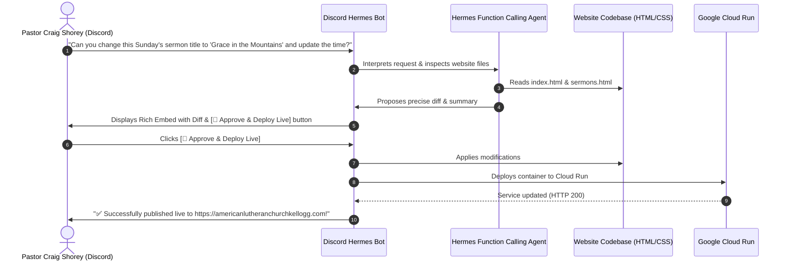

# ⛪ American Lutheran Church — Discord Hermes Webmaster Bot

A dedicated, autonomous Discord bot designed for **Pastor Craig Shorey** and authorized church staff to update the American Lutheran Church website ([americanlutheranchurchkellogg.com](https://americanlutheranchurchkellogg.com)) using plain conversational English in Discord.

Powered by **Hermes Function Calling Agent** (Nous Research Hermes 3) with interactive Discord UI embeds, diff previews, approval buttons, and 1-click Google Cloud Run deployment.

---

## 🌟 How It Works



---

## 🚀 Key Features

1. **Natural Language Website Edits**:
   * Pastor Craig can DM the bot or @mention it in a `#website-updates` channel:
     * *"Can you update the announcement on the homepage to mention the potluck this Friday at 6 PM?"*
     * *"Change Sunday school time to 9:45 AM."*
     * *"Update the quote on about.html to Romans 8:28."*
2. **Photo & Asset Uploads**:
   * Upload an image with the message: *"Make this the new youth ministry banner"* — the bot optimizes the image, saves it to `assets/images/`, and updates the HTML.
3. **Safety & Diff Previews**:
   * The bot never modifies live files without permission. It renders a clean GitHub-style unified diff in Discord with **[Approve & Deploy Live]** and **[Cancel]** buttons.
4. **Access Control**:
   * `AUTHORIZED_USER_IDS` whitelist prevents unauthorized Discord users from making changes.
5. **Instant Serverless Deployment**:
   * Automatically invokes `gcloud run deploy alc-kellogg` to update `https://americanlutheranchurchkellogg.com` live in under 45 seconds.

---

## 🛠️ Setup Instructions

### 1. Create a Discord Bot
1. Go to the [Discord Developer Portal](https://discord.com/developers/applications).
2. Click **New Application** and name it `ALC Webmaster Bot`.
3. In the **Bot** tab:
   - Click **Reset Token** and copy the **Bot Token**.
   - Under **Privileged Gateway Intents**, enable **Message Content Intent**.
4. In the **OAuth2 -> URL Generator** tab:
   - Scopes: `bot`, `applications.commands`
   - Bot Permissions: `Send Messages`, `Embed Links`, `Attach Files`, `Read Message History`, `Use Slash Commands`.
   - Copy the generated URL and open it in your browser to invite the bot to your Discord server.

### 2. Configure Environment Variables
Copy `bot/.env.example` to `bot/.env`:
```bash
cp bot/.env.example bot/.env
```
Fill in the values:
```env
DISCORD_BOT_TOKEN="your_discord_bot_token"
HERMES_API_KEY="your_openrouter_or_openai_api_key"
HERMES_BASE_URL="https://openrouter.ai/api/v1"
HERMES_MODEL="nousresearch/hermes-3-llama-3.1-70b"

GCP_PROJECT="openclaw-gateway-489207"
GCP_REGION="us-west1"
CLOUD_RUN_SERVICE="alc-kellogg"
AUTHORIZED_USER_IDS="123456789012345678"  # Pastor Craig's Discord User ID
```

### 3. Run Locally or on a Server
Install requirements:
```bash
pip install -r bot/requirements.txt
```

Launch the bot:
```bash
python -m bot.main
```

---

## 💬 Slash Commands

* `/status` — Displays the live health status of `americanlutheranchurchkellogg.com` and the Cloud Run container.
* `/pages` — Lists all editable website files.
